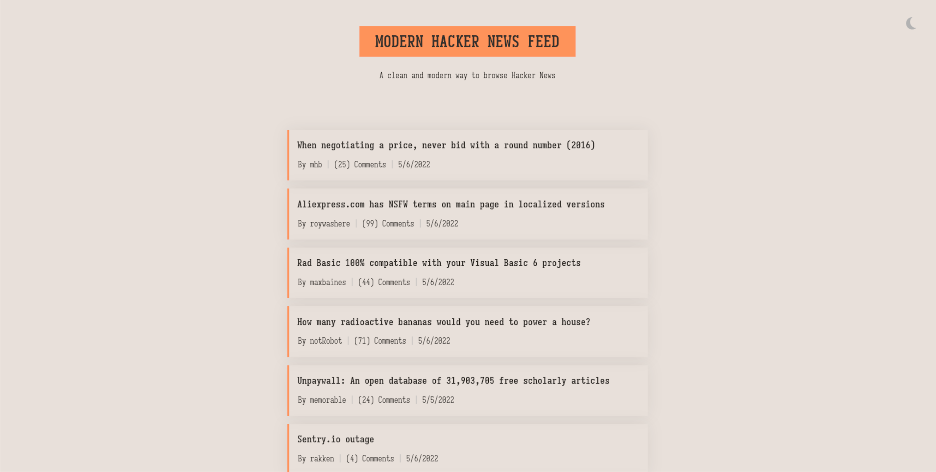

# Modern Hacker News Feed



A clean and modern way to browse Hacker News

### About

A simple feed for the hacker news website using their API.

## Installation

Requires ``npm`` to build it.

1. Clone the repo
	```
	git clone https://github.com/wroveda/modern-hacker-news-feed.git
	```
2. Install the dependencies
	```
	npm install
	```
3. Build the site
	```
	npm run dev
	```
4. Connect to the displayed url with your prefered browser

## Example

Example of the project deployed here: [site](https://modern-hacker-news-feed.netlify.app/)

## License

Distributed under the MIT license. See ``LICENSE`` for more information.
